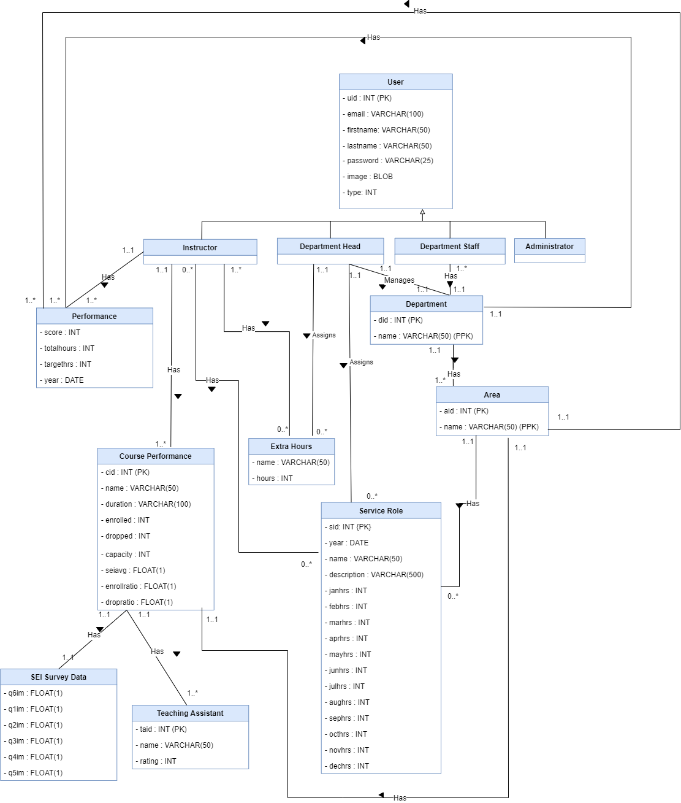
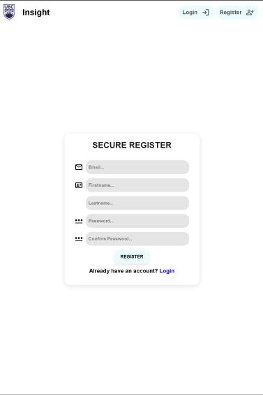

# UBC Insight - System Design

**Team Number:** 4

**Team Members:** Angelina Dubrule, Catherine Magoke, Sumer Mann, Kate Naychuk, Clement Abel-Nwachukwu

## Introduction

Insight is a Department Management System web application that will enhance the efficiency and transparency in the CMPS department. The department head will gain a clear overview of all instructors' activities, enabling the identification of both high-performing and underperforming instructors through intuitive data visualizations and insightful reports. Meanwhile, instructors benefit from accessing their own performance metrics, allowing them to gauge their progress against department-wide targets. The system will incentivize instructors to excel through analytical visualizations, ranking mechanisms, and proactive notifications. The department staff will manage the input of service roles, teaching assignments and TA assignments data and IT administrators will be responsible for account and system management. Overall, Insight fills a crucial gap in the department's infrastructure, fostering a culture of continuous improvement, ultimately increasing the quality of student experiences.

## System Architecture Design

For our system architecture, we have adopted the Model-View-Controller (MVC) pattern due to its modularity, scalability, and maintainability. Since this is a web-based application, the user will interact with the system via a browser. The Model represents the data layer where we use the built-in Laravel ORM to communicate with our MySQL database through a customer database adapter. This adapter will allow a seamless transition, if necessary, to another database. The View corresponds to the React components responsible for the user interface and presentation logic. React's component-based architecture simplifies UI development and enables reusability. The Controller encompasses the server-side logic implemented in Laravel, handling tasks such as HTTP requests and routing. Additionally, both the front-end and back-end will communicate with Tableau to display various data visualizations. Finally, all these separate components of the system will be containerized using docker to simplify the deployment process.

**Note:** Because we are using Laravel, both the frond-end and back-end interactions, including server-side logic, routing, and data interaction, are handled through the framework. 

## Use Case Models

| ID | 1 |
|---|---|
| Name: | Register Account |
| Actor(s): | Instructor, Department Head, Department Staff, and Administrator |
| Flow of Events: | <ul><li>Navigates to the website and clicks on the sign-up button</li><li>The user is redirected to sign-up form</li><li>Enters their information and chooses their role as instructor, department head, department staff, or administrator</li><li>Chooses a password and clicks ‘Register’ Upon creation of the account, redirects to the sign-in page</li></ul> |
| Pre-Conditions: | Users must not have an existing account  |
| Post-Conditions: | <ul><li>Account is created for the user to access</li><li>User information is stored in the database</li></ul>  |
| Description: | A registration process for the user to access the website  |

| ID | 2.a |
|---|---|
| Name: | Successful Login |
| Actor(s): | Instructor, Department Head, Department Staff, and Administrator |
| Flow of Events: | <ul><li>Navigates to the website and clicks on the sign-in button</li><li>Enters the correct credentials</li><li>Redirects to the dashboard after successful login</li></ul>  |
| Pre-Conditions: | <ul><li>The user should be logged out The credentials entered by the user are correct</li><li>The credentials stored in the database are correct to the respective user</li></ul>  |
| Post-Conditions: | The user can log in |
| Description: | The login process for all users to the website  |

| ID | 2.b |
|---|---|
| Name: | Failed Login |
| Actor(s): | Instructor, Department Head, Department Staff, and Administrator |
| Flow of Events: | <ul><li>Navigates to the website and clicks on the sign-in button</li><li>Enters the correct credentials</li><li>Toast requests user to retry form submission</li></ul> |
| Pre-Conditions: | <ul><li>The user should be logged out</li><li>The credentials entered by the user are incorrect</li><li>The credentials stored in the database are incorrect to the respective user</li></ul>  |
| Post-Conditions: | The user must reattempt log in |
| Description: | The login process for all users to the website  |

| ID | 3 |
|---|---|
| Name: | Access Account Settings |
| Actor(s): | Instructor, Department Head, Department Staff, and Administrator |
| Flow of Events: | <ul><li>Navigates to the website and clicks on the sign-in button</li><li>Enters the correct credentials </li><li>Redirects to the dashboard after a successful login</li><li>Clicks “Settings” icon Redirects to “Settings” page</li></ul>  |
| Pre-Conditions: | <ul><li>The user should have an existing account</li><li>The credentials entered by the user are correct</li></ul> |
| Post-Conditions: | The user can see their settings page,  |
| Description: | The user can access the account settings. |

| ID: | 4 |
|---|---|
| Name: | View Visualizations  |
| Actor(s): | Instructor, Department Head |
| Flow of Events: | <ul><li>Navigates to the website and clicks on the sign-in button</li><li>Enters correct credentials</li><li>Redirects to the dashboard after successful login</li><li>The visualization will be displayed on the main dashboard</li></ul> |
| Pre-Conditions: | <ul><li>The credentials should be correct</li><li>Data must be uploaded and synched for visualizations to appear</li></ul> |
| Post-Conditions: | <ul><li>The user’s login attempt is stored in the database</li><li>Users are able to see their current performance in the form of visualization and graphs</li></ul>  |
| Description: | Viewing the visualizations of progress and work in a given time period  |

| ID: | 5 |
|---|---|
| Name: | Track Performance |
| Actor(s): | Instructor, Department Head |
| Flow of Events: | <ul><li>Navigates to the website and clicks on the sign-in button</li><li>Enters the correct credentials </li><li>Redirects to the dashboard after a successful login</li><li>Scrolls down the dashboard</li><li>The user is able to view performance metrics, service roles, and scheduled hours</li></ul> |
| Pre-Conditions: | <ul><li>The login credentials should be correct</li><li>Data must be uploaded and synched for performance to appear</li></ul> |
| Post-Conditions: | <ul><li>The user’s login attempt is stored in the database</li><li>Users can track their performance and set up future goals accordingly</li></ul>  |
| Description: | Users will be able to keep track of their service roles, scheduled hours, and other metrics |

| ID: | 6 |
|---|---|
| Name: | View Assigned TAs |
| Actor(s): | Instructor |
| Flow of Events: | <ul><li>Navigates to the website and clicks on the sign-in button</li><li>Enters the correct credentials </li><li>Redirects to the dashboard after a successful login</li><li>Scrolls down the dashboard</li><li>The user can view their assigned TAs and hours associated with them</li></ul> |
| Pre-Conditions: | <ul><li>The login credentials should be correct</li><li>The instructor must be assigned at least one TA</li></ul>  |
| Post-Conditions: | <ul><li>The user’s login attempt is stored in the database</li><li>User is able to view their assigned TAs and their associated hours</li></ul>  |
| Description: | The user is able to view assigned TAs and the hours associated with them.  |

| ID: | 7.a |
|---|---|
| Name: | Assign Service Role |
| Actor(s): | Department Head and Department Staff |
| Flow of Events: | <ul><li>Navigates to Assign Service Role page</li><li>Chooses a service role and assigns it to the instructor(s)</li><li>Submits request</li></ul> |
| Pre-Conditions: | Must be logged in |
| Post-Conditions: | Service role is assigned to the instructor(s) |
| Description: | The user will be able to assign service roles to one or more instructors  |

| ID: | 7.b |
|---|---|
| Name: | Assign Extra Hours  |
| Actor(s): | Department Head and Department Staff |
| Flow of Events: | <ul><li>Navigates to assign service role page </li><li>Selects “Add Extra Hours” button</li><li>Inputs title, description,  and hours</li><li>Selects instructors who attended Submits request</li></ul> |
| Pre-Conditions: | Must be logged in |
| Post-Conditions: | Meeting hours will be added for the instructors that attended the meeting |
| Description: | The Department Head or Department Staff will be able to add extra hours to Instructor performance |

| ID | 8.a |
|---|---|
| Name: | Create Service Role/Extra Hours |
| Actor(s): | Department Head and Department Staff |
| Flow of Events: | <ul><li>Navigates to Service Roles page</li><li>Selects "Create New Service Role" or "Add Extra Hours"</li><li>Fills out a form with new service role or extra hours information (name, hours, description, etc.) and selects instructors they apply to</li><li>Submits request</li></ul>|
| Pre-Conditions: | Must be logged in |
| Post-Conditions: | New service role(s) or extra hours is added to the database |
| Description: | Creates new service role or extra hours |

| ID | 8.b |
|---|---|
| Name: | Edit Service Role/Extra Hours |
| Actor(s): | Department Head and Department Staff |
| Flow of Events: | <ul><li>Navigates to Service Roles page</li><li>Selects “Manage Service Roles”</li><li>Searches for and selects the Service Roles or Extra Hours they want to edit</li><li>Fills out a form to edit the information for the selected service role (name, hours, description, etc.)</li><li>Submits request</li></ul> |
| Pre-Conditions: | <ul><li>Must be logged in</li><li>Database must contain existing service role/extra hours data</li></ul> |
| Post-Conditions: | Service role information is modified in the database |
| Description: | Edits information for an existing service role |

| ID | 8.c. |
|---|---|
| Name: | Remove Service Role/Extra Hours |
| Actor(s): | Department Head and Department Staff |
| Flow of Events: | <ul><li>Navigates to Service Role page</li><li>Selects “Manage Service Roles”</li><li>Searches for and selects “Delete” on the Service Roles or Extra Hours they want to remove</li><li>User is prompted with an “Are you sure you want to delete this Service Role/Extra Hours?”, and must enter and submit password to select “Yes”</li><li>If password is correct, submits request</li></ul> |
| Pre-Conditions: | <ul><li>Must be logged in</li><li>Database must contain existing service role/extra hours data</li></ul> |
| Post-Conditions: | Service role/extra hours information is removed from the database |
| Description: | Deletes existing service role or extra hours |

| ID | 9.a |
|---|---|
| Name: | Add Performance Data |
| Actor(s): | Department Head and Department Staff |
| Flow of Events: | <ul><li>Navigates to Performance Data page</li><li>Selects “Add Performance Data”, and selects performance data type (SEI Survey, course section, etc)</li><li>Fills out a form or submits a CSV file containing new performance data information (including the instructor it applies to)</li><li>Submits request</li></ul>|
| Pre-Conditions: | Must be logged in |
| Post-Conditions: | Performance data is added to the database |
| Description: | Adds performance data to an existing instructor |

| ID | 9.b |
|---|---|
| Name: | Remove Performance Data |
| Actor(s): | Department Head and Department Staff |
| Flow of Events: | <ul><li>Navigates to the “Performance Data” page</li><li>Searches for and selects “Delete” on performance data they want to remove</li><li>User is prompted with an “Are you sure you want to delete this Service Role/Extra Hours?”, and must enter and submit password to select “Yes”</li><li>If password is correct, submits request</li></ul> |
| Pre-Conditions: | <ul><li>Must be logged in</li><li>Database must contain existing performance data</li></ul> |
| Post-Conditions: | Performance data is removed from the database |
| Description: | Deletes performance data for an existing instructor |

| ID: | 10 |
|---|---|
| Name: | View Instructor’s Visualizations |
| Actor(s): | Department Head |
| Flow of Events: | <ul><li>Navigates to “Performance by Instructor” page</li><li>Searches for and selects instructor name</li><li>Redirects to individual performance dashboard</li></ul> |
| Pre-Conditions: | <ul><li>Must be logged in</li><li>Data must be uploaded and synched for visualizations to appear</li></ul> |
| Post-Conditions: | Dashboard will be displayed with performance visualizations for the instructors |
| Description: | The Department Head will be able to see a dashboard with visualizations of an individual instructor’s performance |

| ID: | 11 |
|---|---|
| Name: | Export Instructor Report |
| Actor(s): | Department Head |
| Flow of Events: | <ul><li>Navigates to “Performance by Instructor” page</li><li>Searches for and selects instructor name</li><li>Redirects to individual performance dashboard</li><li>Click download button to download the report</li></ul> |
| Pre-Conditions: | <ul><li>Must be logged in</li><li>Performance data must exist</li></ul> |
| Post-Conditions: | Report will be downloaded to the device |
| Description: | The Department Head will be able to download the individual report for an instructor |

| ID: | 12 |
|---|---|
| Name: | Export Department Report |
| Actor(s): | Department Head |
| Flow of Events: | <ul><li>Navigates to the website and clicks on the sign-in button</li><li>Enters the correct credentials</li><li>Redirects to the dashboard after a successful login to view the department performance dashboard</li><li>Click download button to download the report</li></ul> |
| Pre-Conditions: | Performance data must exist |
| Post-Conditions: | Report will be downloaded to the device |
| Description: | The Department Head will be able to download the report to view the performance overview of all instructors |

| ID: | 13.a |
|---|---|
| Name: | Create User Account |
| Actor(s): | Administrator |
| Flow of Events: | <ul><li>Navigates to “User Accounts” page</li><li>Selects “Create New User”</li><li>Selects user type (admin, dept. head, instructor)</li><li>Fills out a form with new user information (email ID, password etc.)</li><li>Submits request</li></ul> |
| Pre-Conditions: | Must be logged in |
| Post-Conditions: | New user account(s) is added to database |
| Description: | Creates a new user account |

| ID: | 13.b |
|---|---|
| Name: | Edit User Account Information |
| Actor(s): | Administrator |
| Flow of Events: | <ul><li>Navigates to “User Accounts” page</li><li>Searches for and selects the user account they want to edit</li><li>Fills out a form to edit account information of the selected user account (email ID, password, etc.)</li><li>Submits request</li></ul>|
| Pre-Conditions: | <ul><li>Must be logged in</li><li>Database must contain existing user account</li></ul> |
| Post-Conditions: | User account information is modified in the database |
| Description: | Edits account information for an existing user account |

| ID | 13.c |
|---|---|
| Name: | Remove user account |
| Actor(s): | Administrator |
| Flow of Events: | <ul><li>Navigates to the “User Accounts” page</li><li>Searches for and selects “Delete” on the user account(s) they want to remove</li><li>User is prompted with an “Are you sure you want to delete this Service Role/Extra Hours?”, and must enter and submit password to select “Yes”</li><li>If password is correct, submits request</li></ul> |
| Pre-Conditions: | <ul><li>Must be logged in Database must contain existing user account</li></ul> |
| Post-Conditions: | User account(s) information is removed from the database |
| Description: | Deletes account of an existing user |

## Database Design 

Our system consists of nine main entities: User, Department, Area, Performance, Course Performance, SEI Survey Data, Service Role, Extra Hours, and Teaching Assistant. The User entity includes attributes for email (unique identifier), first name, last name, and password, with four sub-entities (Instructor, Department Head, Department Staff, and Administrator) to represent different user groups.

The Department entity has attributes of unique ID and name which is has one-to-many relationship with the Area entity. The Area entity also has a unique ID and name and has one-to-many relationship with performance. 

The Performance enitity includes attributes for score, total hours, target hours, and year. Performance is associated with one instructor, an area or a department.

The Service Role entity includes attributes for a unique ID, name, description, year and hours for each month. The Department Head may assign zero or more service roles. Instructors may be assigned to multiple service roles, and each role can be assigned to multiple instructors. The Extra Hours entity has attributes of name and hours. Instructors may be assigned to zero or more extra hours, and each extra hour can be assigned to multiple instructors.

Instructors have a one-to-many relationship with the Course Performance entity, requiring each instructor to have at least one course they are teaching. Course Performance include a unique identifier, performance metrics (enrollment, dropouts, capacity), and course duration to calculate total teaching hours. Each Course Performance has a one-to-one relationship with the SEI Survey Data entity, which includes attributes for the Interpolated Median of six survey questions.

Finally, Course Peformance have a one-to-many relationship with Teaching Assistants, where multiple teaching assistants can work on multiple courses, but each assistant must be assigned to at least one course. This diagram accurately represents the data managed within our system.

## Data Flow Diagram (Level 0/Level 1)

Our level 0 data flow diagram displays the four user groups (instructors, department heads, administrators, and department staff) which interact with the system. Both the instructors and department heads can receive information, however the department staff and administrators can only input or change data via an interface. The department heads and staff can add performance data while the administrators can only access account management functionality.

Like the level 0, our level 1 data flow diagram displays how the four user groups interact with the system. This diagram however, gives a deeper look into the actions done by the users and the process in which these requests are handled by the system. Each user needs to interact with the authentication page to verify who they are and the type of user. Certain users (instructors and department heads) can view data from the dashboard and certain users (department heads and department staff) can insert data that will be visible on the dashboard. In this diagram, these interactions are grouped together within Data Form as that will be the main way of inserting info. The administrator can perform various account interactions in Manage Accounts as seen on the diagram. These interaction requests are sent to the server to verify and if necessary, check with the database. If all is successful, the data gets updated in the database and is sent back to the user.

## User Interface (UI) Design

### UI Mockups

**User Authentication: Registration and Login**

**User Authentication: Forgot Password**

**User Settings**

Settings interface for the basic general user (Instructors). All users will see this but department heads and above will see additional data

**Admin Dashboard**

On successful login, each user will be redirected to their dashboard which looks like this. For instructors, they will see just a preview of their performance data. Department heads and admins will see additional data based on their roles.

**Admins Instructor list page**

Edit Mode

View Mode

**Admin Import Data**

Create New Service Role or Extra Hours

**Service Roles Manager**

Manage Services Roles/Requests and View Logs

[add image]

Upload Performance Data (i.e., SEI Survey)

Manual Entry

Visual Feedback

### Navigation Flow Diagrams

