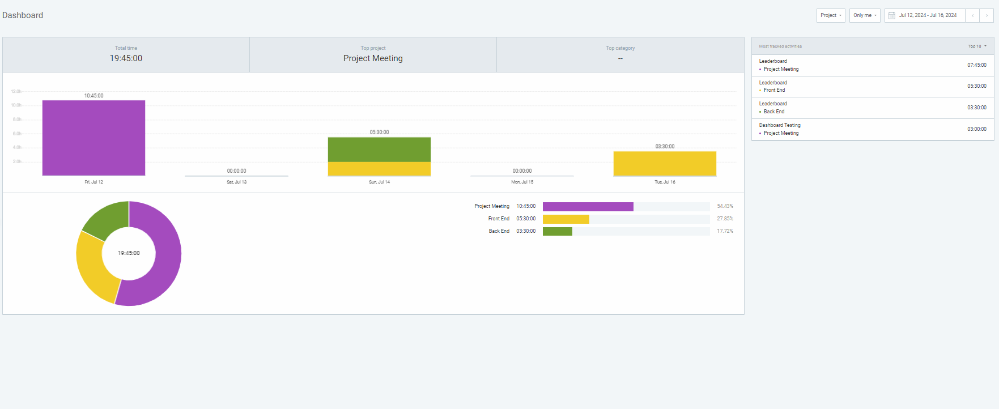

# Angelina's Personal Log 

## Wednesday (8/8 - 8/9)

### Timesheet
Clockify report

### Current Tasks 
 * #1: Prepare for Final Presentation
 * #2: Final Presentation
 * #3: Individual Report
 * #4: Review/Close Final Issues
 * #4: Push to Master

### Progress Update 
| **TASK/ISSUE #**          | **STATUS**  |
|---------------------------|-------------|
| Prepare for Presentation  | Completed   |
| Final Presentation        | Completed   |
| Individual Report         | Completed   |
| Review/Close Final Issues | Completed   |
| Push to Master            | Completed   |

### Cycle Goal Review 
COntinued completing the final report and submitted before the deadline. Prepared for the presentation including practicing a demo. Completed the final presentaion for the course. Reviewed outstanding issues and closed issue which had been completed. Assessed outstanding issues to determine if they should be prioritized, and closed issues that could not be finished as such. Pushed the final product to Master.

### Next Cycle Goals
 * Review Reports

---

## Friday (8/2 - 8/7)

### Timesheet
Clockify report

### Current Tasks 
 * #1: Distribute Issues from Test-O-Rama
 * #2: Debug Report Rendering
 * #3: Change Permissions such that Instructors May Access their Reports
 * #4: Add limit (5) to Dashboard previews for Service Roles, Extra Hours, and Courses for Instructor & Area Dashboards
 * #4: Write Individual Report

### Progress Update 
| **TASK/ISSUE #**          | **STATUS**  |
|---------------------------|-------------|
| Distribute Final Issues   | Completed   |
| Debug Report Rendering    | Completed   |
| Change Report Permissions | Completed   |
| Dashboard Preview Limit   | Completed   |
| Write Individual Report   | In Progress |

### Cycle Goal Review 
Distributed final tasks among group members from client feedback and feature list. Changed the area model and export report backend to add null checks for teach relation, this corrected error identified during Test-O-Rama. Changed access permissions so that instructors could export their own performance data. Added limit to chart controller so that only 5 service roles, extra hours, or course sections are displayed at a time, as page was starting to look crowded. Continued working on individual report.

### Next Cycle Goals
 * Testing, testing, testing
 * Prepare for final presentation
 * Finalize & Submit Individual Report

---

## Wednesday (7/31 - 8/1)

### Timesheet
Clockify report

### Current Tasks 
 * #1: Debug Score Method
 * #2: Debug Database Seeder
 * #3: Add Year Filter to Leaderboard
 * #4: Debug Area Filter on Dashboard
 * #5: Debug Leaderboard Preview on Dashboard
 * #6: Create Dashboard Help Page
 * #7: Create Leaderboard Help Page
 * #8: Fix Score Method so Values are not Negative
 * #9: Update Leaderboard Help Page Score Calculation Summary
 * #10: Prepare for Test-O-Rama

### Progress Update 
| **TASK/ISSUE #**          | **STATUS**  |
|---------------------------|-------------|
| Debug Score Method        | Completed   |
| Debug Database Seeder     | Completed   |
| Year Filter Leaderboard   | Completed   |
| Debug Area Filter         | Completed   |
| Debug Leaderboard Preview | Completed   |
| Dashboard Help Page       | Completed   |
| Leaderboard Help Page     | Completed   |
| Update Score Method       | Completed   |
| Update Leaderboard Page   | Completed   |
| Prepare for Test-O-Rama   | Completed   |

### Cycle Goal Review 
Debugged score method it as it was overwriting the other performance data. Found bugs in the database seeder in the process and corrected these issues. Added filtering by year for the leaderboard query. Debugged area filter leaderboard button not displaying data when merged into pre-dev branch. Debugged dashboard leaderboard displaying instructors with null performance. Created a help page for the dashboard and leaderboard. Reassesssed and changed score method to prevent negative values. Edited leaderboard help page accordingly. Prepared for Test-O-Rama.

### Next Cycle Goals
 * Add more links and messages to Dashboard
 * Testing, Testing, Testing
 * Continue Individual Report
 * Add Filler to Dashboards with Blank Values
 * Add Dropdown to Performance Dashboard

---

## Friday (7/26 - 7/30)

### Timesheet
Clockify report

### Current Tasks 
 * #2: Add Score Method to Performance Model
 * #4: Correct Leaderboard Query
 * #5: Backend Dashboard Area Filter
 * #6: Front End Dashboard Area Filter
 * #7: Add Year Filter to Leaderboard
 * #8: Prepare for Test-O-Rama

### Progress Update 
| **TASK/ISSUE #**          | **STATUS**  |
|---------------------------|-------------|
| Add Score Method          | Completed   |
| Debug Score Method        | In Progress |
| Correct Leaderboard Query | Completed   |
| Area Filter Back End      | Completed   |
| Area Filter Front End     | Completed   |

### Cycle Goal Review 
Finalized score calculation and added score method to instructor performance model. Began debugging score method as it did not work as expected. Added an area filter to the department dashboard and modified the chart controller and front end to accomodate data differences. Fixed the leaderboard query to account for service roles and extra hours.

### Next Cycle Goals
 * Continue debugging score calculation method
 * Add more links and messages to dashboard
 * Add year filter to leaderboard
 * Testing, Testing, Testing

---

## Wednesday (7/24 - 7/25)

### Timesheet
Clockify report

### Current Tasks 
 * #1: Configure View Report Button on Dashboard
 * #2: Add Switch Button to Dashboard
 * #3: Add Year Filtering to Dashboard
 * #4: Troubleshoot Staff page
 * #5: Create Admin Dashboard
 * #6: Add Links to Admin Dashboard
 * #7: Debug Chart Controller
 * #8: Add Profile to Dashboard

### Progress Update 
| **TASK/ISSUE #**          | **STATUS**  |
|---------------------------|-------------|
| Dashboard Report Button   | Completed   |
| Dashboard Switch Button   | Completed   |
| Dashboard Year Filter     | Completed   |
| Troubleshoot Staff Page   | Completed   |
| Create Admin Dashboard    | Completed   |
| Admin Dashboard Links     | Completed   |
| Debug Chart Controller    | In Progress |
| Dashboard Profile         | In Progress |

### Cycle Goal Review 
Added filtering by year to dashboard and discovered many bugs where chart controller failed to check for null values. Corrected these bugs and then added a switch button for department heads who also have an instructor role, so they might be able to view their own dashboard. Troubleshooted some staff list bugs with Catherine. Removed action to kick out admin user and created an admin dashboard. Linked the dashboard menu to the respective pages. 

### Next Cycle Goals
 * Add score calculation method to Performance Model
 * Add Instructor Profile to Dashboard
 * Add more links and messages to dashboard
 * Correct leaderboard query
 * Add year filter to leaderboard
 * Testing, Testing, Testing

---

## Friday (7/19 - 7/23)

### Timesheet
Clockify report

### Current Tasks 
 * #1: Create Performance Page Front End
 * #2: Configure Performance Page Routing
 * #3: Add Handling for Performance Routes to Chart Controller
 * #4: Identify Issues from Test-A-Thon
 * #5: Distribute Test-A-Thon Issues
 * #6: Add Buttons to Dashboard
 * #7: Add Profile to Dashboard

### Progress Update 
| **TASK/ISSUE #**          | **STATUS**  |
|---------------------------|-------------|
| Add Dashboard Buttons     | In Progress |
| Distribute Issues         | Completed   |
| Identify Issues           | Completed   |
| Update Chart Controller   | Completed   |
| Performance Page Routing  | Completed   |
| Performance Front End     | Completed   |
| Dashboard Profile         | In Progress |

### Cycle Goal Review 
Identified and distributed issues to fix post test-a-thon during group meeting on Friday. Added routing from the staff page to the performance page and added handling for these different routes to the chart controller. Created first draft of the performance page frontend for individual staff. Began adjusting routes and Chart Controller for dashbard buttons. Added report button to Dashboard, but ran into some issues with styling so this is still in progress. Added a container for the staff profile to the Dashboard.

### Next Cycle Goals
 * Add Filtering, Links, Color Changes and Role-Switching to Dashboard
 * Add score calculation method to Performance Model
 * Add Administrator Dashboard
 * Testing, Testing, Testing

---

## Wednesday (7/17 - 7/18)

### Timesheet
Clockify report

### Current Tasks 
 * #1: Leaderboard Rank Front End
 * #2: Leaderboard Rank Back End
 * #3: Add Badges to Leaderboard
 * #4: Enhance Badge Style
 * #5: Score Calculation Method
 * #6: Dashboad Buttons and Links
 * #7: Add Instructor Charts
 * #8: Prepare for first test-a-thon
 * #8: Create Performance Page and Configure Routing & Handling

### Progress Update 
| **TASK/ISSUE #**          | **STATUS**  |
|---------------------------|-------------|
| Score Calculation Method  | In Progress |
| Enhance Badge Style       | Completed   |
| Add Badges to Leaderboard | Completed   |
| Leaderboard Rank Front End| Completed   |
| Leaderboard Rank Back End | Completed   |
| Dashboard Buttons & Links | In Progress |
| Instructor Charts         | Completed   |  
| Testing Preparation       | Completed   |

### Cycle Goal Review 
Created backend methods to allow for rank in the leaderboard to be pulled to the dashboard. Added and created, and stylized badges for the leaderboard gamification. Updated the badge styles to look cuter with Clements assistance. Added charts to the instructor dashboard. Prepared for testing with team members, and assigned roles for each team member. 

### Next Cycle Goals
 * Add Filtering, Links, Color Changes and Role-Switching to Dashboard
 * Add score calculation method to Performance Model
 * Add Administrator Dashboard
 * Add Performance Page
 * Testing, Testing, Testing

---

## Friday (7/12 - 7/16)

### Timesheet
Clockify report

### Current Tasks 
  * #1: Create Dashboard Tests
  * #2: Leaderboard Design
  * #3: Add Pie Charts to Department Dashboard
  * #4: Leaderboard Front End
  * #5: Leaderboard Back End
  * #6: Leaderboard Tests
  * #7: Create and Implement Value for Score in the Database
  * #8: Make Leaderboard Department Specific
  * #9: Add leaderboard preview to Dashboard

### Progress Update 
| **TASK/ISSUE #**          | **STATUS**  |
|---------------------------|-------------|
| Dashboard Tests           | Completed   |
| Leaderboard Design        | Completed   |
| Add Pie Charts            | Completed   |
| Leaderboard Front End     | Completed   |
| Leaderboard back End      | Completed   |
| Leaderboard Tests         | Completed   |
| Score Calculation         | In Progress |
| Dept. Spec. Leaderboard   | Completed   |
| Leaderboard Preview       | Completed   |

### Cycle Goal Review 
Added more tests for the chart controller/dashboard view to cover all baseline tests. All tests now pass. Established a design template for the leaderbpard and used Catherine's staff page as a model to construct the front and back end for the Leaderboard. Ensured that routes were restricted to users with permission to access, and created tests to ensure the leaderboard's functionality. All tests are curently passing, tests cover baseline functionality. Fixed the bug issue with the pie charts on the department head dashboard, and adjusted them to fit the dashboard container. All added changes were pulled into pre-dev-integration, and will be added to developement soon. Created a formula for score to rank instructors in our gamification. Added a preview of the leaderboard to the department dashboard, and edited the leaderboard to be specific to the department of the viewer.

### Next Cycle Goals 
 * Add Leaderboard Rank to Instructor Dashboard
 * Add Badges to the Database for Ranking Gamification
 * Add Instructor Performance page between Report Export page and Staff/Leaderboard pages
 * Add Filtering, Links, Color Changes and Role-Switching to Dashboard
 * Add score calculation method to Performance Model

---

## Wednesday (7/10 - 7/11)

### Timesheet
Clockify report

### Current Tasks 
  * #1: Create Dashboard Tests
  * #2: Refactor Chart Controller
  * #3: Seed Database for Testing
  * #4: Divide Leftover Features
  * #5: Leaderboard Design
  * #6: Add Pie Charts to Department Dashboard

### Progress Update 
| **TASK/ISSUE #**          | **STATUS**  |
|---------------------------|-------------|
| Dashboard Tests           | In Progress |
| Refactor Controller       | Completed   |
| Seed Database             | Completed   |
| Divide Features           | Completed   |
| Leaderboard Design        | In Progress |
| Add Pie Charts            | In Progress |

### Cycle Goal Review 
Updated database seeder and tested with Catherine's help. Completed and fixed all bugs in the chart controller. Created first 6 tests for the chart controller. Divided tasks among team members. Began planning for dashboard enhancement and leaderboard feature. Created a pie chart function for the chart controller. Debugged chart view.

### Next Cycle Goals 
 * Begin Leaderboard integration for Dashboard
 * Complete basic Dashboard testing
 * Begin Leaderboard Frontend
 * Finish Pie Chart

---

## Friday (7/5 - 7/9)

### Timesheet
Clockify report

### Current Tasks 
  * #1: Create Dashboard Tests
  * #2: Refactor Chart Controller
  * #3: Seed Database for Testing

### Progress Update 
| **TASK/ISSUE #**          | **STATUS**  |
|---------------------------|-------------|
| Dashboard Tests           | In Progress |
| Refactor Controller       | In Progress |
| Seed Database             | Completed   |

### Cycle Goal Review 
Created seeders to allow more extensive Dashboard testing. Began refactoring the chart controller for a more efficient backend. Troubleshooted seeder issues and display issues with the new chart controller.

### Next Cycle Goals 
 * Divide leftover tasks
 * Begin new tasks
 * Continue testing and UI enhancement for Dashboard

---

## Thursday (7/4)

### Timesheet
Clockify report

### Current Tasks 
  * #1: Remove Capacity Metric
  * #2: MVP Presentation Slides
  * #3: Test Feauture Integration
  * #4: Create Dashboard Tests
  * #5: MVP Presentation

### Progress Update 
| **TASK/ISSUE #**          | **STATUS**  |
|---------------------------|-------------|
| Remove Capacity Metric    | Completed   |
| MVP Presentation Slides   | Completed   |
| Test Feature Integration  | Completed   |
| Create Dashboard Tests    | In Progress |
| MVP Presentation          | Completed   |

### Cycle Goal Review 
Created the presentation slides for the MVP and tested the features once they were integretated in our development branches. Removed unnecessary capacity metric from the performance tables in the database. Completed MVP presentation.

### Next Cycle Goals 
 * Review MVP Feedback
 * Divide remaining features amongst group members and begin work on them
 * Continue testing and UI enhancement for Dashboard

---

## Wednesday (6/30 - 7/3)

### Timesheet
Clockify report

### Current Tasks 
  * #1: Create Additional Visualizations for Department Dashboard
  * #2: Connect Database to Chart Visualizations
  * #3: Create Leaderboard

### Progress Update 
| **TASK/ISSUE #**          | **STATUS**  |
|---------------------------|-------------|
| Department Visualizations | Completed   |
| Connect Database to Charts| Completed   |
| Dashboard Leaderboard     | In Progess  |
| Create Dashboard Tests    | In Progress |

### Cycle Goal Review 
Updated the database to supply all of the necessary data for the dashboard to extract. Completed modifying the charts backend to allow for role based access and account for several user types by connecting to the database. Successfully implemented first draft of dashboard front and backend fucntionality, including role based access and redirection for certain user types.

### Next Cycle Goals 
 * Create tests for dashboard features
 * Get ready for MVP presentation
 * Get a leaderboard and ranking system added to the dashboard

---

## Friday (6/27 - 6/29)

### Timesheet
Clockify report

### Current Tasks
  * #1: Create Additional Visualizations for Department Dashboard
  * #2: Connect Database to Chart Visualizations
  * #3: Remove Need for Custom Plugin for the Progress Bar
  * #4: Create Leaderboard
  * #5: Improve Container Structure for Dashboard

### Progress Update 
| **TASK/ISSUE #**          | **STATUS**  |
|---------------------------|-------------|
| Department Visualizations | In Progess  |
| Connect Database to Charts| In Progess  |
| Remove Progress Bar Plugin| Completed   |
| Dashboard Leaderboard     | In Progess  |
| Improve Containers        | Completed   |

### Cycle Goal Review 
Removed the need for a progress bar plugin by using a horizontally stacked bar chart instead of a regular horizontal bar chart. Added details to the new progress bar and began creating a solid container structure for the dashboard. Began creating visualizations and designing the final version of the dashboard, and created space for all of the data we wished to present, including the leaderboard.

### Next Cycle Goals 
 * Integrate user role based access for dashboard
 * Begin connecting database to the charts
 * Continue creating formatting for the leaderboard and lists
 * Create tests for dashboard features

---

## Wednesday (6/23 - 6/26)

### Timesheet
Clockify report

### Current Tasks 
  * #1: Debug Chart.JS issues
  * #2: Continue Integration of Progress Bar Plugin
  * #3: Improve Dashboard Containers
  * #4: Change Environment to Linux for faster navigation

### Progress Update 
| **TASK/ISSUE #**          | **STATUS**  |
|---------------------------|-------------|
| Debug Chart.JS Issues     | Completed   |
| Progress Bar Plugin       | In Progress |
| Improve Containers        | In Progress |
| Move to Linux             | Completed   |

### Cycle Goal Review 
Began debugging Chart.JS and worked with Clement to move my environment to linux so that the pages loaded faster as the slow rendering was hindering my chart testing process. This environment change proved to be more complicated than expected, and we encountered hurdles such as long download and updating time, needing to reinstall docker, conflicting index.html files, reconfiguring php, and other extension confiuration related errors. This process took the majority of our project meeting. Debugging Cahrt.JS also took some time, as the plugin setup caused the charts to no longer appear. Upon reintegrating CHart.JS, I have decided using a plugin for the progress bar may be overkill and unnecessary, and my time would be more valuably spent working on all of the dashboard components.

### Next Cycle Goals 
  * Find a new way to display a progress bar without a custom plugin
  * Continue improving the container structure of the dashboard
  * Add leaderboard to dashboard frontend
  * Connect database to charts
  * Create charts for the department dashboard

---

## Friday (6/20 - 6/22)

### Timesheet
Clockify report

### Current Tasks 
  * #1: Modify Chart Controller to Display a Relevant Chart Template
  * #2: Add Second Chart to Chart Controller
  * #3: Create Progress Bar Plugin
  * #4: Add Instructor Lists to Dashboard
  * #5: Create Container Structure for Dashboard

### Progress Update
| **TASK/ISSUE #**          | **STATUS**  |
|---------------------------|-------------|
| Modify Chart Controller    | Completed   |
| Dashboard Containers      | In Progess  |
| Add Chart Controller      | In Progress |
| Dashboard Instructor List | Completed   |
| Progress Bar Plugin       | In Progress |

### Cycle Goal Review 
Finished updating the chart controller to display a chart relevant to our data and began formatting the dashboard containers. Began adding a second chart to display the progress bar, and started to create a plugin for said chart. Added lists for service roles, course sections, and extra hours to the dashboard, and formatted them appropriately for the project vision. Creating the progress bar plugin proved more difficult than expected, and setting up Chart.JS proved to be a bit of a learning curve. I have not done much front end design for web pages either, so I am working to become more familiar with the container structue. More research was necessary this week than in other parts of the project, but progress is still evident.

### Next Cycle Goals 
  * Contiune configuring progress bar plugin
  * Finalize chart controller and connect to database
  * Finish creating containers for all dashboard items, and submit to group for review

---

## Wednesday (6/16 - 6/19)

### Timesheet
Clockify report

### Current Tasks 
  * #1: Database Model Factory Setup
  * #2: Database Model Basic Testing
  * #3: Database Model Detailed Testing
  * #4: Research Chart Library
  * #5: Create Chart Controller

### Progress Update 
| **TASK/ISSUE #**          | **STATUS**  |
|---------------------------|-------------|
| Basic Model Testing       | Completed   |
| Detailed Model Testing    | In Progess  |
| Model Factory Setup       | Completed   |
| Research Chart Library    | Completed   |
| Create Chart Controller   | Completed   |

### Cycle Goal Review 
Finished creating Factories for the models and completed basic unit tests for each model. Continued detailed testing for database relations. Researched open source libraries for charts/visualizations and selected Laravel ChartJS. Created a chart controller file and began configuration.

### Next Cycle Goals 
  * Contiune adding relation tests to database models
  * Continue creating dashboard visualizations

---

## Friday (6/13 - 6/15)

### Timesheet
Clockify report

### Current Tasks 
  * #1: Database Model Factory Setup
  * #2: Database Model Testing
  * #3: Discuss priorities for next Milestone
  * #3: Assigned next issues to group members
  * #4: Finalized and presented Mini-Presentaion 1

### Progress Update
| **TASK/ISSUE #**          | **STATUS**  |
|---------------------------|-------------|
| Assign next issues        | Completed   |
| Discuss priorities        | Completed   |
| Database Model Testing    | In Progess  |
| Model Factory Setup       | In Progess  |
| Mini-Presentation 1       | Completed   |

### Cycle Goal Review 
Comtinued creating Factories for the models and creating unit tests for each model. Discussed progress with the group and delivered presentation.

### Next Cycle Goals 
  * Complete Database Model Factory 
  * Complete Database Model Testing
  * Begin dashboard visualization research
  * Begin dashboard visualization implementation

---

## Wednesday (6/9 - 6/12)

### Timesheet
Clockify report

### Current Tasks 
  * #1: Database Model Setup
  * #2: Database Table Setup
  * #3: Fix Personal Log
  * #4: Database Model Factory Setup
  * #5: Datbase Model Testing

### Progress Update 
| **TASK/ISSUE #**          | **STATUS**  |
|---------------------------|-------------|
| Database Table Setup      | Completed   |
| Database Model Testing    | In Progess  |
| Model Factory Setup       | In Progess  |
| Database Model Setup      | Completed   |
| Fix Personal Log          | Completed   |

### Cycle Goal Review 
Created the database tables in the migrations folder. Created models for the completed tables. Completed the requested restructuring of the personal log. Began creating Factories for the models and created the first of the unit tests for each model. Discussed progress with the group and prepared for the presentation.

### Next Cycle Goals 
  * Complete Database Model Factory 
  * Prepare for client review
  * Complete Database Model Testing
  * Complete and continue preparing for presentation
  * Divide tasks for next cycle

---

## Friday (6/6 - 6/8)

### Timesheet
Clockify report

### Current Tasks 
  * #1: Design Presentation
  * #2: Docker setup
  * #3: Database Table setup

### Progress Update 
| **TASK/ISSUE #**          | **STATUS**  |
|---------------------------|-------------|
| Design Presentation       | Complete    |
| Docker setup              | Complete    |
| Database Table setup      | In Progress |

### Cycle Goal Review 
I completed the Design Presentation and Docker setup successfully. The Database Table setup is still in progress.

### Next Cycle Goals 
  * Complete Database Table setup
  * Prepare for client review
  * Continue improving Docker environment

---

## Wednesday (6/2 - 6/5)

### Timesheet
Clockify report

### Current Tasks 
  * #1: Design Document
  * #2: Design Presentation
  * #3: Setup Laravel

### Progress Update 
| **TASK/ISSUE #**          | **STATUS**  |
|---------------------------|-------------|
| Design Document           | In Progress |
| Design Presentation       | In Progress |
| Setup Laravel             | Complete    |

### Cycle Goal Review 
I made significant progress on the Design Document and Presentation. Both are still in progress.

### Next Cycle Goals 
  * Complete Design Document
  * Finalize Design Presentation
  * Continue Environment Setup

---

## Friday (5/30 - 6/1)

### Timesheet
Clockify report

### Current Tasks 
  * #1: Design Document
  * #2: Design Presentation

### Progress Update 
| **TASK/ISSUE #**          | **STATUS**  |
|---------------------------|-------------|
| Design Document           | In Progress |
| Design Presentation       | In Progress |

### Cycle Goal Review 
I started working on the Design Document and Design Presentation.

### Next Cycle Goals 
  * Continue Design Document
  * Continue Design Presentation
  * Set up project environment

---

## Wednesday (5/26 - 5/29)

### Timesheet
Clockify report

### Current Tasks 
  * #1: Project Plan Document
  * #2: Project Plan Presentation
  * #3: Design Documentation

### Progress Update 
| **TASK/ISSUE #**          | **STATUS**  |
|---------------------------|-------------|
| Project Plan Document     | Complete    |
| Project Plan Presentation | Complete    |
| Design Documentation      | In Progress |

### Cycle Goal Review 
We completed the Project Plan Document and Presentation as planned. The design documentation has been started.

### Next Cycle Goals 
  * Finalize Design Documentation
  * Start Design Presentation

---

