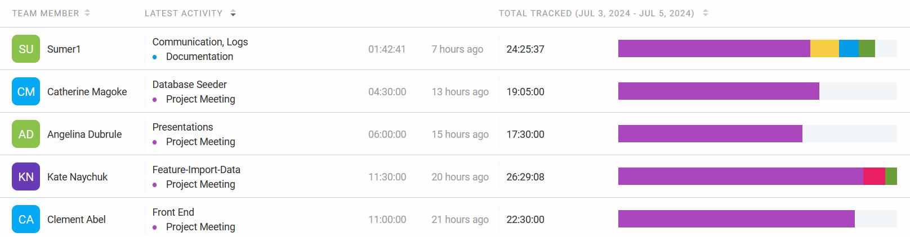
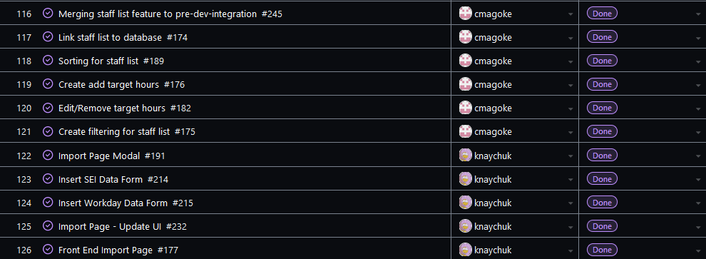
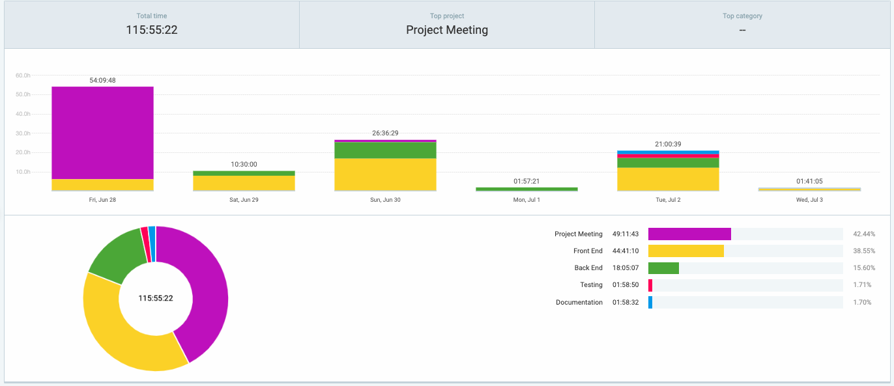
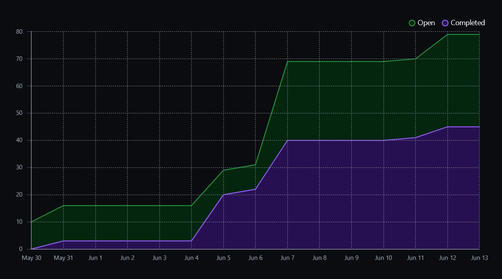

# Weekly Team Log

## Date Range:

- July 5 - July 9

## Features in the Project Plan Cycle:

- Testing
- Refactor UI to be consistent
- Instructor Report Page & Export
- Course Details Page
- Service Roles - Audit Logs, Requests
- Gamification & Leaderboard
- Import Page - File Upload
- Drone CI

## Associated Tasks from Project Board:

## Tasks for Next Cycle:

## Burn-up Chart (Velocity):

## Times for Team/Individual

## Completed Tasks

## In Progress Tasks / To do:

## Test Report / Testing Status:

## Overview:
In terms of feature implemented, we have met our goal as we wanted to have more than 50% of our features completed and we have about 70%. We are working on refactoring our UI for the different pages so that it will be consistent throughout and improving our pages. We are behind in terms of testing and hope to be caught up by the next cycle. We have started working on instructor report page. We will start working on gamification, with the leaderboard.

## Date Range:

- July 3 - July 4

## Features in the Project Plan Cycle:

- Integrate Import Page
- Integrate Course Details Page
- Integrate Dashboard Visualizations
- Integrate Service Role Management
- Drone CI
- Testing

## Associated Tasks from Project Board:

## Tasks for Next Cycle:

## Burn-up Chart (Velocity):

## Times for Team/Individual

## Completed Tasks

## In Progress Tasks / To do:

## Test Report / Testing Status:

## Overview:

We have everything ready for the MVP that we wanted. We have integrated all our pages and features into one branch and have manaully tested they work together. We also created the slides for the presentation

## Date Range:

- June 28 - July 2

## Features in the Project Plan Cycle:

- Staff Page
- Import Page
- Course Details Page
- Role Based Access
- Dashboard Visualizations
- Service Role Management
- Drone CI
- Testing

## Associated Tasks from Project Board:

## Tasks for Next Cycle:

## Burn-up Chart (Velocity):

## Times for Team/Individual

## Completed Tasks

## In Progress Tasks / To do:

## Test Report / Testing Status:

## Overview:

We are wrapping up the features needed for the MVP. In the final cycle before the deadline, we will work on integrating all the exisiting issues and features our team members have been working on. Finally, we hope to polish any performance issues and wrap up testing to ensure everything runs smoothly.

## Date Range:

- June 26 - June 27

## Features in the Project Plan Cycle:

- Staff Page
- Import Page
- Course Details Page
- Role Based Access
- Dashboard Visualizations
- Service Role Management
- Drone CI

## Associated Tasks from Project Board:

## Tasks for Next Cycle:

## Burn-up Chart (Velocity):

## Times for Team/Individual

## Completed Tasks

## In Progress Tasks / To do:

## Test Report / Testing Status:

## Overview:

We are making progress with our features. We started integrating the course details page and import page together. We also decided to use livewire for our pages to improve performance. We plan to continuing integrating all of our current features to make sure they work well together.

## Date Range:

- June 21 - June 25

## Features in the Project Plan Cycle:

- Staff Page
- Import Page
- Course Details Page
- Role Based Access
- Service Role Management
- Drone CI

## Associated Tasks from Project Board:

## Tasks for Next Cycle:

## Burn-up Chart (Velocity):

## Times for Team/Individual

## Completed Tasks

## In Progress Tasks / To do:

## Test Report / Testing Status:

## Overview:

We have continued to work on our assigned tasks for the next milestone (MVP) which include the staff page, import page, course details page, role based access and service role management. We are still having some challenges with DroneCI and hope to get it done by next cycle.

## Date Range:

- June 19 - June 20

## Features in the Project Plan Cycle:

- Staff Page
- Import Page
- Database Unit Testing
- Database Factories
- Course Details Page
- Role Based Access
- Service Role Management
- Drone CI

## Associated Tasks from Project Board:

## Tasks for Next Cycle:

## Burn-up Chart (Velocity):

## Times for Team/Individual

## Completed Tasks

## In Progress Tasks / To do:

## Test Report / Testing Status:

## Overview:

We continued to work on our assigned tasks and had a project meeting where we dicussed progress and other design/development choices. Most of our tasks are in progress or todo as we work through our features. Everyone has their issues to implement and we will come together next cycle to review the, hopefully, functional features.

## Date Range:

- June 14 - June 18

## Features in the Project Plan Cycle:

- Staff Page
- Import Page
- Database Unit Testing
- Database Factories
- Course Details Page
- Role Based Access
- Service Role Management

## Associated Tasks from Project Board:

## Tasks for Next Cycle:

## Burn-up Chart (Velocity):

## Times for Team/Individual

## Completed Tasks

## In Progress Tasks / To do:

## Test Report / Testing Status:

## Overview:

This cycle the team focused on the assigned tasks and features given to specific members. This is in preperation for the next big milestone (MVP). In the coming cycles, we aim to have at least 50% functionality completed, with all our core features working.

## Date Range:

- June 12 - June 13

## Features in the Project Plan Cycle:

- Environment Setup
- Registration Feature
- Login Feature
- Forgot Password Feature
- Settings Feature
- General Dashboard Front End
- Database setup
- Database Unit Testing

## Associated Tasks from Project Board:

## Tasks for Next Cycle:

## Burn-up Chart (Velocity):

## Times for Team/Individual

## Completed Tasks

## In Progress Tasks / To do:

## Test Report / Testing Status:

## Overview:

This cycle the team focused on completing the components for the mini project. We have our demo features working and continued to add more.  We have created our presentation slides and are prepared to present. Next cycle we will continue to set up database testing and assign more tasks/features to members.

## Date Range:

- June 7 - June 11

## Features in the Project Plan Cycle:

- Design Video
- Enviroment Set up
- Registration Feature
- Login Feature
- Settings Feature
- General Dashboard Front End
- Database setup

## Associated Tasks from Project Board:

## Tasks for Next Cycle:

## Burn-up Chart (Velocity):

![docs/weekly logs/Burn Up Charts/[Burn Up Chart Image]](https://github.com/UBCO-COSC499-Summer-2024/team-4-capstone-team-4/blob/update-teamlogs/docs/weekly%20logs/burnup/4.png)

## Times for Team/Individual:

![docs/weekly logs/Clockify/[Time Tracking Image]](https://github.com/UBCO-COSC499-Summer-2024/team-4-capstone-team-4/blob/update-teamlogs/docs/weekly%20logs/clockify/summary-6.png)

## Completed Tasks:

## In Progress Tasks/ To do:

## Test Report / Testing Status:

N/A

## Overview:

The team focused on implementing the account registration and login for user, the settings page and the dashboard front end. The Kanban Board has been populated with some features. The next cycle will focus on prepping for the mini-presentation and testing.

## Date Range:

- June 5 - June 6

## Features in the Project Plan Cycle:

- Design Document
- Design Presentation slides
- Design Video
- Environment Set up

## Associated Tasks from Project Board:

## Tasks for Next Cycle:

## Burn-up Chart (Velocity):

![docs/weekly logs/Burn Up Charts/[Burn Up Chart Image]](https://github.com/UBCO-COSC499-Summer-2024/team-4-capstone-team-4/blob/update-teamlogs/docs/weekly%20logs/burnup/3.png)

## Times for Team/Individual:

![docs/weekly logs/Clockify/[Time Tracking Image]](https://github.com/UBCO-COSC499-Summer-2024/team-4-capstone-team-4/blob/update-teamlogs/docs/weekly%20logs/clockify/summary-5.png)

## Completed Tasks:

## In Progress Tasks/ To do:

## Test Report / Testing Status:

N/A

## Overview:

The team focused on completing the design document and working on the presenatation slides. The next cycle will focus on completing the design video and setting up our laravel and docker environment.

## Date Range:

- May 31 - June 4

## Features in the Project Plan Cycle:

- Design Document

## Associated Tasks from Project Board:

## Tasks for Next Cycle:

## Burn-up Chart (Velocity):

![docs/weekly logs/Burn Up Charts/[Burn Up Chart Image]](https://github.com/UBCO-COSC499-Summer-2024/team-4-capstone-team-4/blob/update-teamlogs/docs/weekly%20logs/burnup/2.png)

## Times for Team/Individual:

![docs/weekly logs/Clockify/[Time Tracking Image]](https://github.com/UBCO-COSC499-Summer-2024/team-4-capstone-team-4/blob/update-teamlogs/docs/weekly%20logs/clockify/summary-4.png)

## Completed Tasks:

## In Progress Tasks/ To do:

## Test Report / Testing Status:

N/A

## Overview:

The team focused on finalizing the design doc. The next cycle will focus on creating the presenations and the design video.

## Date Range:

- May 29 - May 30

## Features in the Project Plan Cycle:

- Design Document

## Associated Tasks from Project Board:

## Tasks for Next Cycle:

## Burn-up Chart (Velocity):

![docs/weekly logs/Burn Up Charts/[Burn Up Chart Image]](https://github.com/UBCO-COSC499-Summer-2024/team-4-capstone-team-4/blob/update-teamlogs/docs/weekly%20logs/burnup/1.png)

## Times for Team/Individual:

![docs/weekly logs/Clockify/[Time Tracking Image]](https://github.com/UBCO-COSC499-Summer-2024/team-4-capstone-team-4/blob/update-teamlogs/docs/weekly%20logs/clockify/summary-3.png)

## Completed Tasks:

## In Progress Tasks/ To do:

## Test Report / Testing Status:

N/A

## Overview:

The team focused on working on the design document. We added use cases and its diagram and the system architecture diagram. The next cycle will focus on finishing off the design document.

## Date Range:

- May 24 - May 28

## Features in the Project Plan Cycle:

- Project Plan document
- Project plan presentation slides
- Project Plan video

## Associated Tasks from Project Board:

## Tasks for Next Cycle:

## Burn-up Chart (Velocity):

N/A

## Times for Team/Individual:

![docs/weekly logs/Clockify/[Time Tracking Image]](https://github.com/UBCO-COSC499-Summer-2024/team-4-capstone-team-4/blob/update-teamlogs/docs/weekly%20logs/clockify/summary-2.png)

## Completed Tasks:

## In Progress Tasks/ To do:

## Test Report / Testing Status:

N/A

## Overview:

The team focused on completing the project plan document and video. The Kanban Board has been populated with tasks and assignees for the project plan doc and video. The next cycle will focus on the design document.

## Date Range:

- May 22 - May 23

## Features in the Project Plan Cycle:

- Project Plan document

## Associated Tasks from Project Board:

## Tasks for Next Cycle:

## Burn-up Chart (Velocity):

N/A

## Times for Team/Individual:

![docs/weekly logs/Clockify/[Time Tracking Image]](https://github.com/UBCO-COSC499-Summer-2024/team-4-capstone-team-4/blob/update-teamlogs/docs/weekly%20logs/clockify/summary-1.png)

## Completed Tasks:

N/A

## In Progress Tasks/ To do:

## Test Report / Testing Status:

N/A

## Overview:

The team focused on creating the project plan. The Kanban Board was set up, nothing populated yet. The next cycle will focus on finishing the project plan and creating the project plan video.
